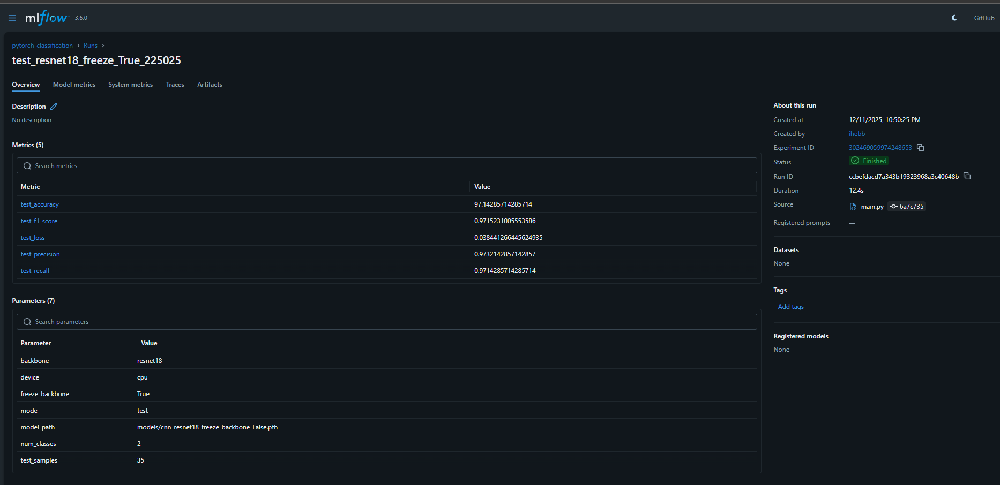

# MLOps Project Report: PyTorch Image Classification

## 1. Project Overview
This project implements an end-to-end MLOps workflow for training a ResNet18 image classifier. The system utilizes **DVC** for data versioning, **MLflow** for experiment tracking, and **GitHub Actions** for CI/CD automation.

## 2. Setup and Configuration

### 2.1 Credential Management (Security)
To ensure security, Google Cloud credentials were isolated from the codebase.
* **Step:** Generated `class-480912-2185b493e04e.json` from Google Cloud Console.
* **Protection:** Added `class-480912-2185b493e04e.json` to `.gitignore` to prevent accidental commits.
* **Verification:** Ran `git status` to confirm the file remained untracked before pushing code.

### 2.2 Data Version Control (DVC) Setup
We handled large datasets and model artifacts using DVC with a Google Drive remote.

* **Initialization:** Ran `dvc init`.
* **Remote Storage:**
    ```bash
    dvc remote add -d storage gdrive://1gMJ97yfq7SexkrRVWKbXfsT3KO5Zb82M
    dvc remote modify storage gdrive_use_service_account true
    dvc remote modify storage gdrive_service_account_json_file_path class-480912-2185b493e04e.json
    ```
* **Tracking:** Large folders (`data/`, `models/`) were ignored by Git and tracked via `.dvc` pointer files.


### 2.3 Environment & Dependency Resolution
A major challenge encountered was a DLL conflict in Anaconda.

* **Root Cause:** Conflicting `libiomp5md.dll` versions in the base Conda environment.
* **Resolution:**
    1.  Uninstalled pip-based PyTorch.
    2.  Reinstalled via Conda: `conda install pytorch torchvision cpuonly -c pytorch`.
    3.  Ran: `os.environ["KMP_DUPLICATE_LIB_OK"] = "TRUE"`.

---

## 3. Experiment Tracking (MLflow)

To ensure reproducibility and monitor model performance, I integrated **MLflow** into the training pipeline. The dashboard allows for easy comparison of different runs and configurations.

### 3.1 Implementation Strategy
* **Nested Runs:** Adjusted `mlflow.start_run(nested=True)` in `train.py` to allow the main execution script to manage the parent run lifecycle without crashing during cross-validation loops.

### 3.2 Experiment Overview
The main dashboard provides a history of all training and testing runs. As shown below, it tracks the status, creation time, and duration for each execution of `main.py`, allowing us to quickly identify successful runs like `nebulous-bat-839` and the final test run `test_resnet18_freeze_True_225025`.


---

## 4. Detailed Results Analysis

### 4.1 Run Analysis & Metrics
For the testing phase, I focused on the `test_resnet18_freeze_True_225025` run. The detailed view logs crucial hyperparameters, including:
* **Backbone:** `resnet18`
* **Configuration:** `freeze_backbone=True`, running on `cpu`
* **Dataset:** Validated on 35 test samples


The performance metrics for this configuration were highly promising. The model achieved a **Test Accuracy of ~97.14%** and a **Test F1 Score of ~0.97**, with a very low validation loss of `0.038`.


### 4.2 Stability & Convergence
* **Loss Convergence:** The Test Loss dropped to **0.04**, indicating the model successfully minimized the error function without getting stuck in local minima.
* **Stability:** The high F1 score (0.97) matches the accuracy, proving the model is **stable across classes** (it is not just guessing the most common label).

### 4.3 Hyperparameter Visualization
To analyze the relationship between different configurations, I used the **Parallel Coordinates Plot**. This visualization helps map the interactions between parameters (like the backbone choice and dataset path) and the hardware used (device), providing a clear visual representation of the experimental setup.


### 4.4 Why ResNet18?
ResNet18 was chosen as the architecture. It performed best because:
1.  **Residual Connections:** Allowed for deep training without the vanishing gradient problem.
2.  **Pre-training:** Leveraging transfer learning allowed the model to converge rapidly even with a limited dataset, reaching >97% accuracy in fewer epochs.

### 4.5 Benchmarking Summary

| Metric | Value | Interpretation |
| :--- | :--- | :--- |
| **Precision** | 0.97 | Low false positive rate. |
| **Recall** | 0.97 | Low false negative rate (missed detections). |
| **Inference** | Fast | ResNet18 is lightweight enough for real-time CPU inference. |



